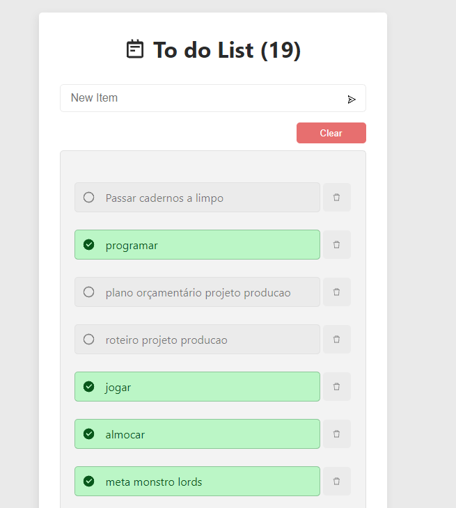

<h1 align="center">📃 ToDo List 📃</h1>
<p align="center">ToDo List project</p>
<h1 align="center">
 
  

</br>
</h1>
</br>

## 🛠 Technologies used

</br>

 
 
 
 
 

## 🚀 How to start

To contribute to this project or learn from it is very simple, just clone this repository on your computer and install the necessary dependencies for it to work. Below you can check how to do this, as well as how to run it on a local server.

### 📌 Requirement

> node package manager (NPM or YARN)

> Git bash (optional, you can download the code directly from GitHub at 'code' > 'Download zip')

### ✨ Now are you ready to start 

> clone the repository
```bash
git clone https://github.com/LuciLua/todo.git
```

> open project folder
 ```bash
cd ./todo
```

> install all packages using npm or yarn manager (using YARN)
```bash
yarn
```

> start the development server (using YARN)
```bash
yarn dev
```

### 🏗 Build 

> to make a build (using YARN)
```bash
yarn run build
```

> to start the server in production-ready mode (using YARN)
```bash
yarn run start
```


## 🖼 Preview

**So far, this is the preview, but you can check it out at [this updated link](https://todo-lucilua.vercel.app/)**


